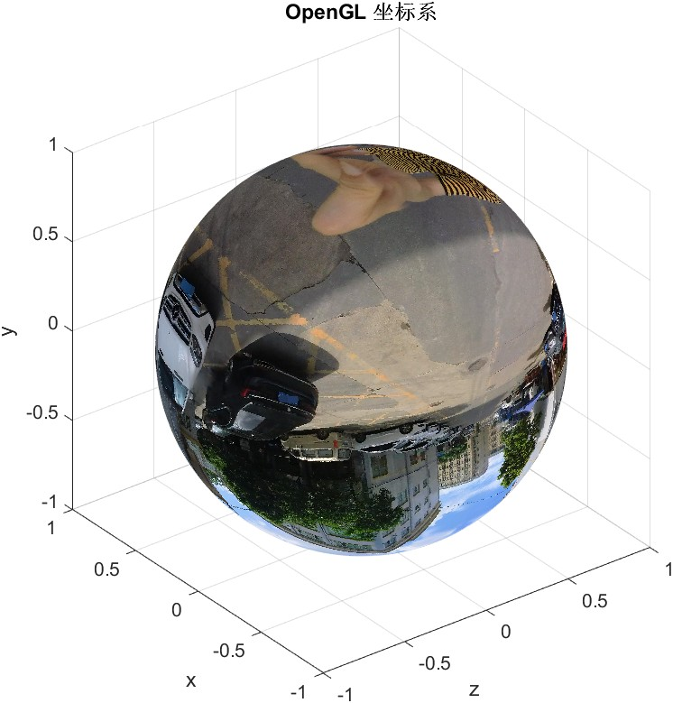

# 360 Panorama Viewer

## :eyes: Overview
桌面360 VR全景查看器，使用C++ OpenGL 渲染全景图像或者视频，它们应当具有[`equirectangular projection`](https://en.wikipedia.org/wiki/Equirectangular_projection)类型的图像或者视频文件，支持鼠标拖曳、滚轮缩放、键盘控制等功能。

<https://github.com/user-attachments/assets/e2ad83f3-ab59-45b2-8718-c3bda1aa53fd>

## :gear: Dependencies

- OpenCV <https://opencv.org/> (用于读取图片、视频和处理文件)
- GLEW <http://glew.sourceforge.net/> （用于OpenGL函数加载）
- GLFW 3 <http://www.glfw.org/> (用于桌面应用程序窗口管理,事件处理)

> [!NOTE]
> 注意：选用上述库的原因是因为它们都是开源的，而且都有良好的跨平台支持。当然也可以选择其它库，比如Qt、FFMPEG、SDL、wxWidgets等。另外，对于桌面360 VR项目的渲染，如果只考虑渲染和性能，GLFW是更推荐的选择，能够提供更好的控制和性能。另一方面，如果需要配合音频、复杂输入和其他多媒体功能，SDL可能会更合适。

## :hammer: How to build

```bash
git clone https://github.com/cuixing158/360-Panorama-Viewer-OpenGL.git
cd 360-panorama-viewer
mkdir build
cd build
cmake ..
cmake --build .
```

## :arrow_forward: How to run

```bash
360Viewer [video_file or image_file]
```

示例全景数据在`data/`目录下，可以直接加载运行。

鼠标操作:

- 左键按住并拖动：平移视角方向
- 滚轮滚动：缩放视角

键盘操作:

- A,D左右移动视角
- W,S上下移动视角
- F1 照片动画师模式1
- F2 照片动画师模式2
- F3 照片动画师模式3
- P 导出照片动画师为视频
...

*照片动画师模式*可以描述为一张全景图片自动生成一段不同视角的视频，并且按照一定的速度播放，形成动画播放效果。

> [!IMPORTANT]
> 全景图像渲染使用的OpenGL坐标系如下：
> 

> [!TIP]
> 欲体验桌面支持视频剪辑的**TOY-APP版本**交互操作，请参阅我的MATLAB实现“[360° Panorama Studio](https://github.com/cuixing158/panorama360Studio)” repo。

## References

1. <https://github.com/cuixing158/360-panorama-OpenGLES>
1. <https://github.com/ulikk/panoviewer>
1. <https://github.com/pwrobel-logitech/panoramic>
1. <https://github.com/Martin20150405/Pano360>
